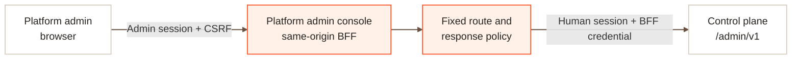

The platform admin console is a separate browser application for AcornOps platform administrators. Use it for deployment-wide governance and recovery tasks. Workspace members continue to use the [management console](/use) for targets, investigations, Agents, Workflows, tools, and approvals.

<Warning>
  The platform admin console intentionally cannot access tenant logs, workspace audit events, target identities, Agents, sessions, runs, prompts, commands, tools, credentials, or workload controls. It does not support impersonation.
</Warning>

## What administrators can manage

### Overview

The overview provides a governance-safe portfolio summary:

- workspace and user totals,
- aggregate connected Kubernetes and VM environment counts,
- the three workspaces with the largest connected-environment footprint,
- suspended-workspace, identity-verification, and environment-concentration signals.

These figures describe governance and connection footprint. They do not represent workload health, platform readiness, run activity, or tenant usage.

### Users and workspace access

Use the Users directory to search by identity, filter by email verification state, and inspect an existing user's workspace access. A full platform administrator can:

- grant an existing AcornOps user access to a workspace,
- select a role from the deployment's role catalog,
- update one workspace role,
- revoke one workspace membership at a time.

The console cannot create user accounts, resolve a missing account from an email address, or remove a user from every workspace in one client-orchestrated operation. Owner safeguards prevent a mutation that would leave a workspace without an owner.

### Workspace governance

Use the Workspaces directory and details panel to:

- search workspaces and filter active or suspended state,
- review the creator, current plan, member count, and aggregate Kubernetes and VM connection counts,
- grant an existing user access, update a member role, or revoke individual access,
- change the workspace plan,
- suspend or restore member access.

Suspension retains memberships, targets, workloads, references, and audit history. It blocks ordinary member access; it does not stop or modify workloads. Suspension and restoration require the administrator to type the exact workspace name.

Workspace capacity follows the selected plan. The console does not expose per-workspace quota overrides, hard deletion, retention countdowns, or purge.

### Platform settings

Platform Settings separates two categories:

- **Workspace:** member discovery and password-signup policy.
- **AI:** AI policy and write-only default keys for OpenAI, Anthropic, and Gemini.

The page shows each setting's effective value, deployment boundary, source, and policy blockers. Full platform administrators can save or reset supported runtime overrides. Provider keys can be replaced or explicitly deleted, but key values are never returned after submission.

### Admin audit

Admin Audit records privileged governance actions with privacy-filtered event, actor, object, outcome, time, and correlation details. Administrators can filter by event family, workspace, human administrator, outcome, and time range.

This ledger is distinct from workspace audit logs. It excludes source-IP hashes, user agents, session hashes, target and run identifiers, and unrestricted metadata from browser responses.

## Platform roles

| Role | Console access |
| --- | --- |
| `platform-admin` | Read and mutate supported governance state, including write-only provider-key operations |
| `platform-admin-viewer` | Read governance state, except the protected Admin Audit ledger |
| `platform-admin-auditor` | Read the administrator's own identity and the Admin Audit ledger only |

Navigation visibility is not authorization. The same-origin BFF and control plane both enforce every request.

## Enable the console

The platform admin console and admin API are off by default. The supported production path is the Kubernetes platform chart. Configure a dedicated admin host, keep direct admin API ingress disabled, and enable the console, private admin API, and administrator OIDC session together:

```yaml
platform:
  adminConsoleUrl: https://admin.example.com
exposure:
  ingress:
    adminHost: admin.example.com
adminApi:
  enabled: true
  ingress:
    enabled: false
  tokens:
    existingSecretName: acornops-platform-secrets
    tokensJsonKey: CONTROL_PLANE_ADMIN_TOKENS_JSON
platformAdminAccess:
  enabled: true
  session:
    maxAgeSeconds: 3600
    idleTimeoutSeconds: 900
    reauthSeconds: 900
  oidc:
    issuerUrl: https://id.example.com/realms/acornops
    clientId: acornops-platform-admin
    allowedRoles: platform-admin,platform-admin-viewer,platform-admin-auditor
    requiredAmrValues: mfa,otp,webauthn,hwk
components:
  platformAdminConsole:
    enabled: true
```

Create a dedicated confidential OIDC client with:

- the exact callback `https://admin.example.com/admin-auth/oidc/callback`,
- PKCE S256,
- identity-provider-enforced MFA,
- only the three platform roles listed above,
- no password grant, service-account login for humans, wildcard redirect, or self-registration.

Generate a random BFF token. Store the raw value at the Secret key configured by `secrets.keys.platformAdminConsole.adminToken`, and store only its SHA-256 token descriptor in `CONTROL_PLANE_ADMIN_TOKENS_JSON`. Grant that descriptor the chart's exact console scopes, never `admin:*`. Generate separate `ADMIN_OIDC_CLIENT_SECRET` and `ADMIN_CSRF_SECRET` values.

When internal transport TLS is enabled, also configure `internalTransport.tls.certificates.platformAdminConsole.secretName`. Route every path on the admin host through the console BFF and keep `adminApi.ingress.enabled=false`.

<Note>
  The VM Compose production path does not currently install the platform admin console. Use the Kubernetes platform chart for this governance surface.
</Note>

## Security boundary

Production access uses a dedicated OIDC client with PKCE and identity-provider-enforced MFA. Password login and self-signup are not available on this console.



The browser calls only fixed, same-origin `/admin-console-api/*` routes. The console's server maps them to an explicit `/admin/v1/*` allowlist, keeps its upstream credential server-side, rejects broad or operational scopes, and projects responses before returning them to the browser. The control plane independently checks both the human administrator session and the console service credential. Writes also require CSRF evidence and recent authentication.

## Console or admin API?

Use the platform admin console for the supported governance workflows above. Use the [control-plane admin API](/deploy/admin-operations) only for an authorized operational or break-glass workflow that is not exposed in the console. The API has a broader security surface, so keep its tokens out of browsers and grant the narrowest scopes possible.
