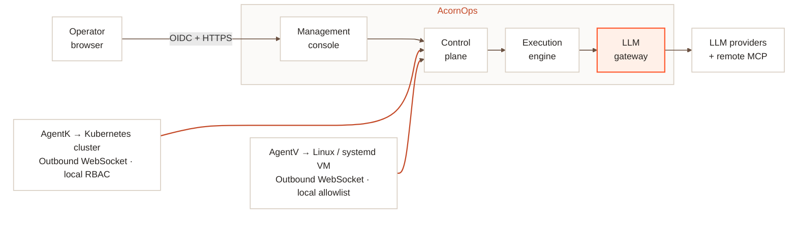

AcornOps separates the operator experience, platform state, run execution, model/tool access, and target access into distinct components. The platform has a target core for Kubernetes clusters and Linux/systemd VMs. That separation keeps public traffic narrow and lets target agents connect outbound only.

## System overview

**Platform state:** Postgres provides durable state. Redis provides coordination, routing, and event fanout.

**Outbound target connectors keep target access local; the central platform owns identity, orchestration, policy, and the run record.**

## Component responsibilities

| Component | Responsibility | Public exposure |
| --- | --- | --- |
| Management console | Workspace, target, member, tool, and session user experience | `https://console.example.com/` |
| Control plane | Auth, workspaces, target core, Kubernetes and VM APIs, agent WebSockets, run state, webhooks, API authorization | `https://api.example.com/api/v1` |
| Execution engine | Run lifecycle, orchestration loop, event emission, cancellation, tool-call coordination | Internal only |
| LLM gateway | Provider routing, run-scoped model access, MCP registry, secret lookup, gateway auditing | Internal only |
| Platform admin console (optional) | Deployment-wide governance UI and fixed-route BFF for the private admin API | Dedicated admin host |
| AgentK | Kubernetes cluster snapshots, logs, and builtin Kubernetes tool execution | Outbound only |
| AgentV | Bounded Linux/systemd snapshots and strict built-in tools; optional local helper for allowlisted service restart | Network outbound only |

The optional platform admin console is intentionally outside the tenant runtime path shown above. It uses a dedicated OIDC client and forwards only fixed governance routes to the private control-plane admin API. It cannot access target operations, sessions, runs, prompts, tools, or tenant audit records.

## Runtime flow

1. An operator signs in through OIDC and uses the management console with a cookie-backed control-plane session.
2. The operator creates a workspace, registers a cluster or VM, and installs the generated agent command.
3. The target connector authenticates with its agent key and opens an outbound WebSocket to the control plane.
4. The agent sends heartbeats, capability metadata, and snapshots. The control plane persists target state and synchronizes builtin tools into the LLM gateway.
5. When an operator sends a troubleshooting message, the control plane creates a run and dispatches it to the execution engine.
6. The execution engine fetches run context from the control plane, streams model requests through the LLM gateway, and calls allowed tools.
7. The control plane records run events and streams them back to the management console.

Remote MCP servers use the same run-scoped tool permission model. Each installation belongs to one Agent. The gateway discovers remote tools from `tools/list`, stores them pending explicit review, and invokes only an exact `{serverId, toolName}` reference allowed by the immutable run snapshot.

## Auth and trust boundaries

AcornOps uses separate credentials for separate trust boundaries:

| Channel | Credential |
| --- | --- |
| Browser to control plane | Session cookie |
| Platform admin browser to console BFF | Dedicated admin session cookie and CSRF evidence |
| Platform admin console BFF to control plane | Narrow admin workload token plus the authenticated human session |
| Control plane to execution engine | `EXECUTION_ENGINE_DISPATCH_TOKEN` |
| Execution engine to control plane | `ORCH_SERVICE_TOKEN` |
| Control plane to LLM gateway admin API | `LLM_GATEWAY_ADMIN_TOKEN` |
| LLM gateway to control-plane built-in MCP bridge | Control-plane-signed run JWT |
| Execution engine to LLM gateway runtime API | Control-plane-signed run JWT |
| target agents to control plane | Target agent key |

Run-scoped JWTs include workspace, target, session, run, allowed provider, allowed model, allowed tool, and output-budget claims. Kubernetes clusters and virtual machines use the same target scope model. The LLM gateway rejects requests whose body scope does not match the token scope.

Remote MCP credentials are secret-backed. Non-secret `publicHeaders` may be forwarded to remote MCP servers, but platform scope headers such as `x-workspace-id`, `x-target-id`, `x-target-type`, and `x-run-id` are reserved and are added by the gateway.

## Workspace and role model

A workspace contains members, audit events, targets, Kubernetes clusters, VMs, MCP registries, Agents with independently installed capabilities, sessions, runs, and webhooks. Server responses include role-derived permissions so clients can show available actions without reimplementing authorization rules.

The deployment defines the supported workspace role templates. `owner` is always present, protected, and required. Deployments can disable non-owner built-ins (`admin`, `operator`, `viewer`, `auditor`) and define custom lowercase snake_case roles with supported workspace capabilities. Workspaces assign members and invitations from this deployment catalog; they cannot edit capability sets or role availability.

The control plane prevents membership changes that would leave a workspace without an owner. Only owners can assign protected roles.

Workspace audit logs are scoped to the workspace and validate filters before querying. Audit metadata is sanitized before it is stored, so raw tokens, secrets, message bodies, pod logs, auth headers, and full tool arguments are not retained. Audit retention removes persisted rows after the configured retention window.

Tool call audit events store only high-level details such as identity, source, target, duration, run id when available, and success or failure. Workspace summary responses hide operational counts from roles without workspace-data read permission; auditors keep member context but receive `clusterCount: 0`.

Troubleshooting conversations are owner-write and viewer-read. The user who starts a conversation can send follow-ups while they still have run creation permission. Other users with target read access can open the conversation and watch active run events live, but they cannot post into that conversation. When a user starts a separate conversation on a target with recent chat activity, the management console shows an inline warning that names recent investigators and highlights recent write-capable activity.

## Data ownership

| Data | Owner |
| --- | --- |
| Workspaces, members, audit events, targets, Kubernetes clusters, VMs, sessions, runs, invitations, webhooks | Control plane |
| Run reservations and worker coordination | Execution engine with Redis |
| Provider credentials, MCP registry, gateway request records | LLM gateway |
| Live Kubernetes discovery and builtin tool behavior | AgentK |
| Live VM host discovery, strict tool behavior, and helper protocol | AgentV |

Agent snapshots are persisted by the control plane and exposed to the management console. Kubernetes snapshots include resources, events, and metrics when available. VM snapshots include host inventory, health findings, metrics, and bounded logs.

## High availability posture

The Kubernetes chart defaults the management console, control plane, execution engine, and LLM gateway to multiple replicas when backed by external Postgres and Redis. The control plane uses Redis for agent routing, command routing between pods, run event fanout, and renewed scheduler leases. If a control-plane pod stops while an agent command is active, that command may fail; the agent reconnects and later commands continue through an available pod.

The AgentK supports active-passive high availability through Kubernetes Lease leader election. When `replicaCount` is greater than one, enable leader election so exactly one agent runtime connects at a time.
