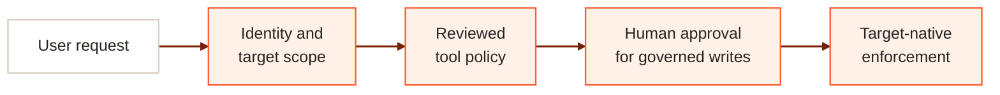
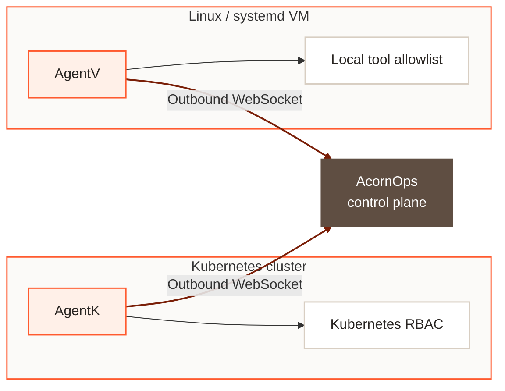

AcornOps uses defence in depth. A platform decision does not replace the controls already present in a Kubernetes cluster or Linux VM. Each request must pass the platform's identity and policy checks, any required human approval, and the target's local enforcement.

## Defence in depth

| Layer | What it enforces |
| --- | --- |
| Identity and target scope | Every request is bound to an authenticated principal, workspace, target, session, and run. Workspace permissions and run-scoped claims constrain what can happen. |
| Tool policy | The model receives only tools compiled into the run's allowed scope. Discovered MCP tools remain disabled until reviewed and enabled. Skills provide instructions but never grant access. |
| Human approval | Read-only and read/write execution are separate capabilities. When policy gates a write, the run pauses for a decision on the exact tool and arguments. Approval does not grant broader access. |
| Target-native enforcement | AgentK remains subject to Kubernetes RBAC. AgentV exposes bounded operations and applies its local allowlist. Either target can reject an action that AcornOps allowed. |

Authorization is checked again at dispatch and before tool execution. Changing a user's role or a target's policy therefore does not silently widen an already compiled run.

<Note>
  An approval authorizes one requested operation. It does not bypass workspace permissions, the run scope, Kubernetes RBAC, or a VM's local policy.
</Note>

## Secure connectivity model

Targets initiate their connection to the central platform. You do not need to expose an inbound AcornOps control port on each connected cluster or VM.

AgentK and AgentV authenticate with target-specific credentials and establish outbound WebSocket connections to the control plane. AgentK uses its existing cluster-key flow. AgentV onboarding exchanges a 15-minute one-use token for a durable credential that is returned only to the root installer. The connection carries heartbeats, capability metadata, snapshots, and bounded tool requests. Target access stays with the connector inside the environment.

Outbound connectivity describes the direction in which the session is established. Administrators must still restrict egress to the expected AcornOps endpoint, validate TLS, protect connector credentials, and apply least-privilege target policy.

## Credential boundaries

AcornOps uses different credentials at different boundaries:

- Browser users authenticate through the configured identity provider and use a cookie-backed control-plane session.
- Target connectors use target-specific credentials; AgentV durable credentials are stored only on the VM and hash-only in the control plane.
- Internal services use dedicated service credentials.
- Model and tool calls use run-scoped tokens that bind the workspace, target, run, provider, model, tools, and output budget.

Secrets for providers and remote MCP servers remain in the configured secret backend. They are not included in prompts or ordinary run events.

## Related guidance

- Review [sessions, runs, and approvals](/overview/sessions-runs-approvals).
- Understand [tools, skills, and MCP policy](/overview/tools-mcp).
- Configure [authentication, approvals, and secrets](/deploy/configuration).
- Follow the [production readiness checklist](/deploy/production-readiness).
